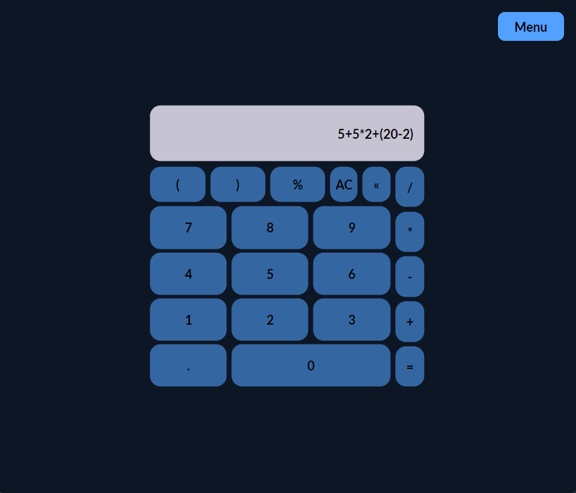
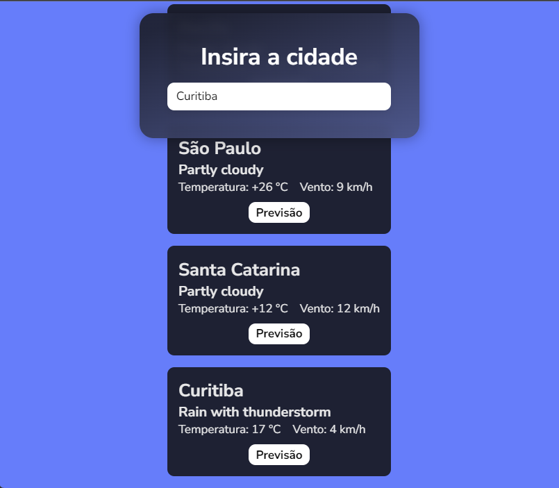
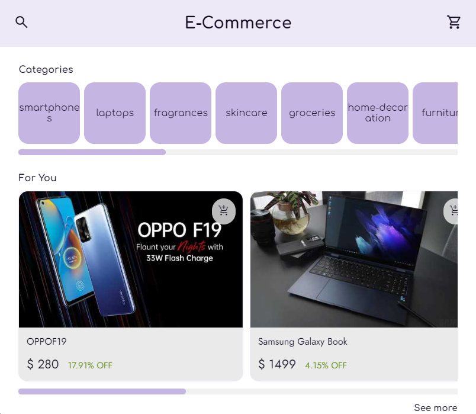
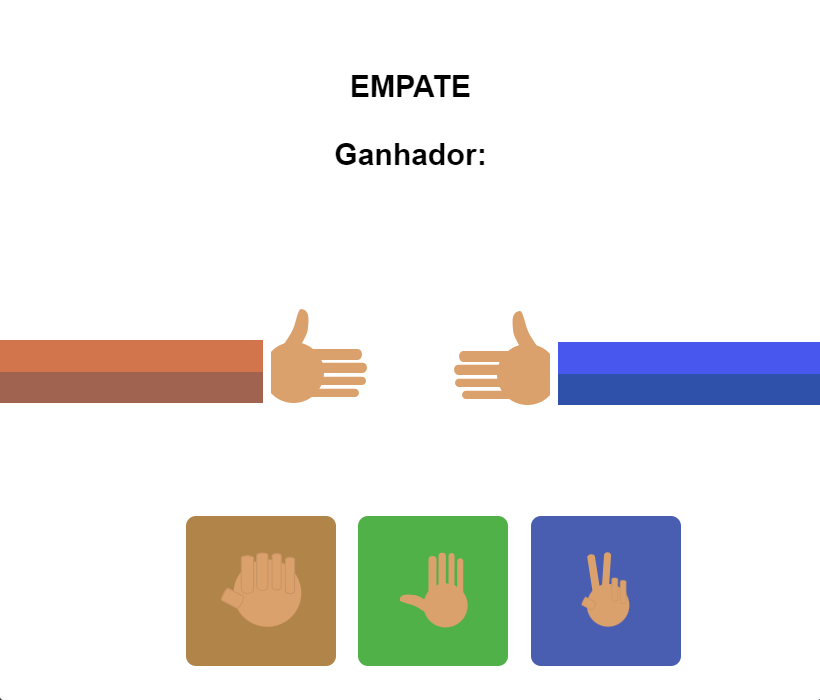

# mini-projects-javascript
Projetos diversos(pequenos e grandes) feitos com o objetivo de praticar javascript e nodejs.

## Veja algum deles
| <h3>Calculadora</h3> | <h3 align="left">Página de climas</h3> | 
| :---        |    ----:   | 
| |  |
| ***Destaque***: Alternância entre modo dark mode e sem dark mode e o salvamento dessa configuração na Local Storage. | 
***Destaque***: fetch API para busca de dados.
 |

| <h3>E-commerce</h3> | <h3 align="left">Game pedra, papel, tesoura</h3> | 
| :---        |    ----:   | 
| |  |
| ***Destaque***: fetch API para pegar os produtos, rotas, como rota do carrinho /cart e webpack com babel. | 
***Destaque***: pedra, papel, tesoura 👍.
 |

